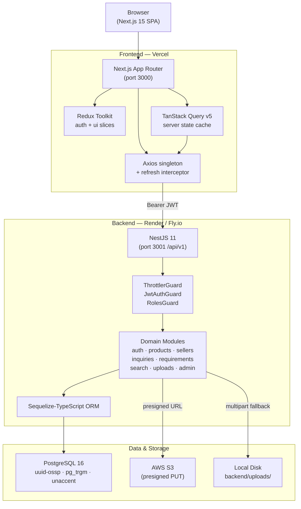
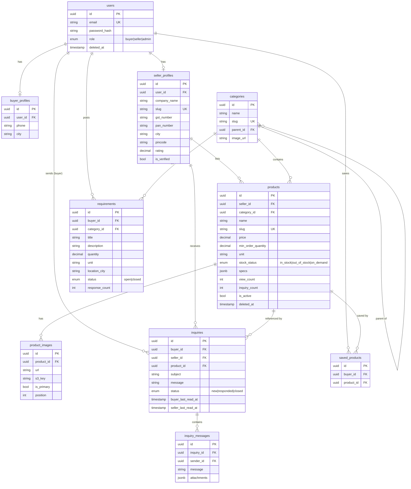

# Architecture Overview

This document describes the architecture of the **indiamart-clone** B2B marketplace as it stands today. For setup and API reference, see the [README](../README.md).

---

## Table of Contents

- [System Architecture Diagram](#system-architecture-diagram)
- [Monorepo Layout](#monorepo-layout)
- [Frontend Architecture](#frontend-architecture)
  - [Routing Model](#routing-model)
  - [State & Data Management](#state--data-management)
  - [Feature-Sliced Modules](#feature-sliced-modules)
  - [Styling](#styling)
  - [Axios & Token Management](#axios--token-management)
- [Backend Architecture](#backend-architecture)
  - [Module Map](#module-map)
  - [Cross-Cutting Concerns](#cross-cutting-concerns)
  - [Request Lifecycle](#request-lifecycle)
- [Data Layer](#data-layer)
  - [Database Schema (Migrations)](#database-schema-migrations)
  - [Seeders](#seeders)
  - [Key Indexes](#key-indexes)
- [Auth Subsystem](#auth-subsystem)
- [Catalog Subsystem](#catalog-subsystem)
- [Inquiries & Requirements](#inquiries--requirements)
- [Search](#search)
- [Uploads](#uploads)
- [Deployment Targets](#deployment-targets)
- [CI Pipeline](#ci-pipeline)

---

## System Architecture Diagram



---

## Monorepo Layout

```
indiamart-clone/
├── frontend/          # Next.js 15 (App Router) + React 19 + Tailwind v4
├── backend/           # NestJS 11 + Sequelize-TypeScript + PostgreSQL 16
├── docker/            # Container init scripts (Postgres bootstrap SQL)
├── docs/              # Architecture docs (this file)
├── .github/workflows/ # CI (lint + build + tests, both workspaces)
└── docker-compose.yml # Local Postgres 16 + pgAdmin
```

Workspaces are managed by **npm workspaces** from the repo root. No Turborepo for now; revisit if CI build times exceed 5 minutes.

---

## Frontend Architecture

### Routing Model

The App Router is divided into five route groups, each with its own layout and protection rules.

```
frontend/src/app/
├── (public)/          homepage, product/category/supplier pages,
│                      search, requirements feed           — No auth required
├── (auth)/            login, register                    — Public; redirects if already logged in
├── (buyer)/           /me/* dashboard area               — Any authenticated user
├── (seller)/          seller dashboard, catalog, leads   — seller + admin roles
└── (admin)/           platform moderation                — admin role only
```

**Key routing behaviours:**
- The root `/` renders a public marketing homepage (`(public)/page.tsx`). Authenticated users are silently redirected to `/me/dashboard` by the `<HomeAuthRedirect>` component rendered inside the page.
- Product detail, category, supplier profile, search results, and the requirements feed are all under `(public)` — fully accessible without login, with a guest banner prompting sign-up.
- The `(buyer)` group hosts the authenticated dashboard area: `/me/dashboard`, `/me/profile`, `/me/inquiries`, `/me/saved`, `/me/requirements`, etc.
- Route protection for authenticated areas is implemented in `frontend/src/features/auth/protected.tsx`, which reads the Redux `auth` slice status and redirects unauthorized users.

Every account is a buyer by default. The `seller` role is additive — sellers see the full buyer surface plus their own seller area.

### State & Data Management

Two complementary state layers are used deliberately:

| Layer | Tool | Scope |
|---|---|---|
| Server state | TanStack Query v5 | Products, inquiries, requirements, sellers, search, dashboards |
| Client state | Redux Toolkit | Auth (user, status, thunks) + UI (seller signup modal) |

**TanStack Query** handles caching, background refetch, optimistic updates, and mutation invalidation for all server-originated data. Query keys are co-located with their feature module.

**Redux Toolkit** is used strictly for cross-cutting client state:

- `auth` slice — `user`, `status` (`idle | loading | authenticated | unauthenticated | error`), thunks for `login`, `register`, `upgradeToSeller`, `hydrate`, `logout`.
- `ui` slice — cross-component UI state such as the seller signup modal (any "Sell" button can dispatch `openSellerModal`).

### Feature-Sliced Modules

Each subfolder under `frontend/src/features/` owns its UI components, hooks, API client wrappers, and Query keys for one product surface:

```
frontend/src/features/
├── admin/             Platform moderation UI (users, sellers, products, categories, inquiries)
├── auth/              Login, register forms; protected.tsx wrapper; seller-signup modal + trigger
├── buyer/             Buyer dashboard, profile editor, KYS lookup, FAQ, ship page
├── categories/        Category tree hook, category API client
├── dashboard/         Seller KPI dashboard, charts, timeseries, top-products
├── home/              Public homepage sections (hero search, category grid, featured products/suppliers,
│                      buy-leads preview, auth-redirect)
├── inquiries/         Inquiry list, thread view, reply form, unread-count hook
├── products/          Product listing, detail view, image gallery, search results grid
├── requirements/      Public feed, my requirements list, post-requirement form, seller leads view
├── saved/             Wishlist list, save/unsave heart toggle, saved-set hook
├── search/            Unified search page, autocomplete API client
├── seller/            Seller catalog editor: product list, product form, product-image manager
├── sellers/           Supplier directory, public supplier profile editor
└── uploads/           Upload widget (S3 presign + local multipart fallback)
```

Shared layout and UI primitives live in `frontend/src/components/{layout,ui,product,supplier,charts,system}`.

### Styling

Tailwind CSS v4 uses the new CSS-first config approach: `@import "tailwindcss"` + `@theme` block in `globals.css`. No PostCSS plugins beyond `@tailwindcss/postcss`. No `tailwind.config.js` file.

### Axios & Token Management

A single Axios instance lives at `frontend/src/lib/axios.ts`. Key behaviors:

- **Access token in module memory** — the token is stored in a module-level variable inside `axios.ts` and injected as a `Bearer` header on every request. It is never written to `localStorage` or `sessionStorage`.
- **Refresh interceptor** — a response interceptor detects 401 responses, attempts a single `/auth/refresh` call, deduplicates concurrent refresh attempts via a shared in-flight promise, stashes the fresh access token, and retries the original request.
- **Loop prevention** — if the failing request is itself `/auth/refresh`, the interceptor short-circuits to avoid a CORS-preflight loop.
- **Redux sync** — after a successful refresh, the interceptor dispatches `hydrate` to keep the Redux `auth` slice in sync.

---

## Backend Architecture

### Module Map

`backend/src/app.module.ts` wires global config + throttling + the database module + the following domain modules:

```
backend/src/modules/
├── auth/              Register, login, refresh, logout, me, upgrade-to-seller
├── users/             User, BuyerProfile, SellerProfile models + internal services
├── categories/        Public tree + slug lookup; admin CRUD
├── products/          Listing, detail, mine, CRUD, image attach/detach
├── sellers/           Public directory, profile by slug, KYS lookup, me profile
├── inquiries/         Create, role-scoped list, thread, reply, status, unread counts
├── requirements/      Buy-leads: list, feed, mine, create, close, seller respond
├── saved-products/    Wishlist: list, ids-only, save, unsave
├── search/            Unified search + autocomplete suggester
├── seller-dashboard/  KPIs, daily timeseries, top products
├── admin/             Platform stats, user moderation, supplier verification, product moderation
└── uploads/           S3 presigned PUT + local-disk fallback + status endpoint

backend/src/common/
├── decorators/        @CurrentUser(), @Public(), @Roles()
├── guards/            JwtAuthGuard, JwtRefreshGuard, RolesGuard
├── health/            Liveness + DB-readiness endpoints
└── utils/             Pagination helper, slugify utility
```

### Cross-Cutting Concerns

**Configuration** — `@nestjs/config` with Joi validation (`backend/src/config/validation.schema.ts`). Required env vars cause boot to fail fast with a descriptive error. AWS vars are optional and validated lazily at the upload service.

**Database** — `@nestjs/sequelize` with `sequelize-typescript`. `synchronize: false` — migrations are the single source of truth. `paranoid: true` and `underscored: true` are global defaults. Pool sizes come from env vars.

**Global guards** (applied in order to every request):

```
ThrottlerGuard → JwtAuthGuard → RolesGuard
```

- `ThrottlerGuard` — rate limiting via `@nestjs/throttler`. Global defaults from env; per-route overrides via `@Throttle(...)`.
- `JwtAuthGuard` — validates the `Authorization: Bearer <token>` header. Routes opt out with `@Public()`.
- `RolesGuard` — evaluates `@Roles(UserRole.X)` metadata against `req.user.role`.

**Validation** — global `ValidationPipe` with `whitelist: true`, `forbidNonWhitelisted: true`, `transform: true`, implicit-conversion enabled. DTOs use `class-validator` + `class-transformer`.

**Security & performance middleware:**

- `helmet` — security headers; `crossOriginResourcePolicy: cross-origin` so the Next.js dev server can embed `/uploads/*` images.
- `compression` — gzip response compression.
- `cookie-parser` — parses the `refresh_token` httpOnly cookie.
- CORS — limited to the configured `CLIENT_URL` (comma-separated list of allowed origins).

**API surface** — all routes prefixed `/api/v1/`. Pagination uses `?page=&limit=&sort=&order=` with a shared `PaginatedResult<T>` response shape.

**Rate limiting** — global defaults from env (`THROTTLE_TTL`, `THROTTLE_LIMIT`). Auth endpoints get tighter per-route overrides (login: 5/min, register: 10/hour).

**Swagger/OpenAPI** — auto-generated and served at `/api/docs` in non-production environments only.

**Graceful shutdown** — `app.enableShutdownHooks()` on bootstrap.

### Request Lifecycle

```
HTTP Request
    │
    ▼
ThrottlerGuard          ← rate-limit check
    │
    ▼
JwtAuthGuard            ← verify Bearer token (skip if @Public())
    │
    ▼
RolesGuard              ← check @Roles() metadata (skip if no decorator)
    │
    ▼
ValidationPipe          ← transform + validate DTO
    │
    ▼
Controller              ← parse input, call service
    │
    ▼
Service                 ← business logic, ownership checks, DB access
    │
    ▼
Sequelize Model         ← ORM query to PostgreSQL
    │
    ▼
HTTP Response
```

---

## Data Layer

PostgreSQL 16 with `uuid-ossp`, `pg_trgm`, and `unaccent` extensions enabled at init (see `docker/`). All tables use UUID primary keys. `created_at` / `updated_at` are required on every table. `deleted_at` is added to every paranoid (soft-delete) table.

### Entity Relationship Diagram



### Database Schema (Migrations)

Migrations under `backend/src/database/migrations/` are the single source of truth and run in numbered order:

| Migration | Table(s) | Key Details |
|---|---|---|
| `0001-create-users` | `users` | email unique, role enum `buyer\|seller\|admin`, bcrypt password hash, paranoid |
| `0002-create-buyer-profiles` | `buyer_profiles` | 1:1 with `users` |
| `0003-create-seller-profiles` | `seller_profiles` | 1:1 with `users`; company name, slug unique, GST, rating, verified flag |
| `0004-create-categories` | `categories` | nested tree via `parent_id`, slug unique |
| `0005-create-products` | `products` | FK → seller + category; slug unique; price/min-order/unit; stock-status enum; JSONB specs; view/inquiry counters |
| `0006-create-product-images` | `product_images` | FK → product; `is_primary`, `position`, `s3_key`, `url` |
| `0007-backfill-seller-slugs` | `seller_profiles` | Data migration: backfills `slug` for rows created before the field was set |
| `0008-create-inquiries` | `inquiries` | FK → buyer, seller, product (optional); subject, message, quantity/unit/expected_price; status enum `new\|responded\|closed`; per-side `last_read_at` |
| `0009-create-inquiry-messages` | `inquiry_messages` | FK → inquiry; threaded messages; JSONB attachments |
| `0010-create-saved-products` | `saved_products` | FK → buyer + product; `(buyer_id, product_id)` unique pair |
| `0011-create-requirements` | `requirements` | FK → buyer + category; title, description, quantity/unit/expected_price, location_city; status enum `open\|closed`; response_count |
| `0012-add-seller-profile-extras` | `seller_profiles` | Adds `city`, `pincode`, `pan_number` (collected by multi-step seller signup) |

### Seeders

Seeders under `backend/src/database/seeders/` are all idempotent (safe to re-run):

| Seeder | What it creates |
|---|---|
| `0001-admin-user` | Default admin user (override via `ADMIN_EMAIL` / `ADMIN_PASSWORD` / `ADMIN_NAME`) |
| `0002-categories` | 6 top-level categories × 5 sub-categories each, idempotent by slug |
| `0003-general-category` | `general` fallback category for the multi-step seller signup |

### Key Indexes

| Table | Index | Purpose |
|---|---|---|
| `products` | GIN trigram on `name` (`pg_trgm`) | Fuzzy `ILIKE` search in listing and unified search |
| `users` | Unique on `email` | Login lookup |
| `seller_profiles` | Unique on `slug` | Public profile URL resolution |
| `categories` | Unique on `slug` | Category page URL resolution |
| `products` | Unique on `slug` | Product detail URL resolution |
| `saved_products` | Unique on `(buyer_id, product_id)` | Prevent duplicate saves |

---

## Auth Subsystem

```
Browser                          Backend
  │                                │
  │  POST /auth/login              │
  │ ──────────────────────────────►│  bcrypt.compare (12 rounds)
  │                                │  sign access token (15m, JWT_SECRET)
  │  { accessToken }               │  sign refresh token (7d, JWT_REFRESH_SECRET)
  │◄──────────────────────────────│  Set-Cookie: refresh_token (httpOnly, Secure, SameSite=Lax)
  │                                │
  │  [store accessToken in Redux + axios module memory]
  │
  │  [page reload — access token lost]
  │
  │  GET /auth/me (no Bearer)      │
  │ ──────────────────────────────►│  401 Unauthorized
  │◄──────────────────────────────│
  │
  │  [axios interceptor fires]
  │
  │  POST /auth/refresh (cookie)   │
  │ ──────────────────────────────►│  verify refresh token
  │  { accessToken }               │  rotate: new access + new refresh cookie
  │◄──────────────────────────────│
  │
  │  [retry GET /auth/me with new Bearer]
  │ ──────────────────────────────►│  200 { user }
  │◄──────────────────────────────│
```

Key properties:

- Two distinct JWT secrets (`JWT_SECRET`, `JWT_REFRESH_SECRET`) — leaking one does not compromise the other.
- Refresh token is rotated on every successful `/auth/refresh` and on `/auth/upgrade-to-seller`.
- `bcrypt` rounds = 12 (constant in `auth.service.ts`).
- Buyer→seller upgrade (`POST /auth/upgrade-to-seller`) collects business details + initial catalog and re-issues a token pair so subsequent requests carry the `seller` role claim.
- Admin seeder is idempotent.

---

## Catalog Subsystem

- **Slugs** are generated server-side from `name` via the `slugify` utility and made unique with a small retry loop, falling back to a random 6-character suffix on collision.
- **Trigram index** (`pg_trgm`) on `products.name` lets fuzzy `ILIKE` search land cheaply; the unified `/search` endpoint reuses the same index.
- **Ownership** is enforced inside `ProductsService.assertOwnerOrAdmin(...)` rather than in a guard, because the loaded entity is needed to compare `sellerId`.
- **View count** is incremented in a fire-and-forget call (no `await`, wrapped in `try/catch`) so a counter failure never breaks a product detail request.
- **Soft deletes** — `paranoid: true` means deleted products are hidden from queries but remain in the DB with a `deleted_at` timestamp.

---

## Inquiries & Requirements

- Every authenticated user can send inquiries and post requirements — the `seller` role is purely additive on top of buyer capabilities.
- **Inquiry list** endpoints are role-scoped: buyers see what they sent, sellers see what they received, admins see everything.
- **Unread counts** — per-side `last_read_at` timestamps on the `inquiries` table power the `/inquiries/counts` endpoint that the navbar badge polls.
- **Seller respond to buy-lead** — `POST /requirements/:id/respond` atomically creates an inquiry between the buyer and the seller, carrying the buyer's requirement context (subject + message) as the opening message.

```
Requirement (open)
    │
    │  POST /requirements/:id/respond  (seller)
    ▼
Inquiry created  ──►  InquiryMessage (opening message with requirement context)
    │
    │  POST /inquiries/:id/messages  (buyer or seller)
    ▼
InquiryMessage (reply)
    │
    │  PATCH /inquiries/:id/status  (seller or admin)
    ▼
Inquiry status: new → responded → closed
```

---

## Search

The `/search` endpoint is unified across three entity types:

| `type` param | Returns |
|---|---|
| `all` (default) | Up to 8 products + 8 suppliers + 8 categories |
| `products` | Paginated products only |
| `suppliers` | Paginated suppliers only |
| `categories` | Flat list of matching categories |

`/search/suggest` is a lightweight autocomplete returning up to 5 hits of each type, designed for navbar dropdowns with minimal latency.

Both endpoints use the trigram GIN index on `products.name` for fuzzy matching and `ILIKE` on supplier company names and category names.

---

## Uploads

The backend supports two interchangeable image-upload backends. Call `GET /uploads/status` to see which is active.

### S3 Presigned PUT (preferred)

```
Browser                    Backend                    AWS S3
  │                           │                          │
  │  POST /uploads/presign    │                          │
  │ ─────────────────────────►│                          │
  │  { uploadUrl, publicUrl,  │  generatePresignedUrl    │
  │    s3Key }                │ ────────────────────────►│
  │◄─────────────────────────│◄────────────────────────│
  │                           │                          │
  │  PUT <uploadUrl> (file)   │                          │
  │ ─────────────────────────────────────────────────── ►│
  │  200 OK                   │                          │
  │◄─────────────────────────────────────────────────── │
  │                           │                          │
  │  POST /products/:id/images { s3Key, url }            │
  │ ─────────────────────────►│                          │
  │  201 Created              │  save ProductImage row   │
  │◄─────────────────────────│                          │
```

The server never proxies bytes — scales independent of upload size. Presigned URLs expire after 5 minutes. If `AWS_S3_BUCKET` is unset, the presign endpoint returns HTTP 503 with operator guidance.

### Local-Disk Fallback

```
Browser                    Backend
  │                           │
  │  POST /uploads/file       │
  │  (multipart/form-data)    │
  │ ─────────────────────────►│  save to backend/uploads/<purpose>/
  │  { url }                  │  serve via @nestjs/serve-static at /uploads/
  │◄─────────────────────────│
  │                           │
  │  POST /products/:id/images { url }
  │ ─────────────────────────►│  save ProductImage row
  │  201 Created              │
  │◄─────────────────────────│
```

Max upload size and accepted MIME types (`image/jpeg|png|webp|gif`) are constants in `uploads.constants.ts` and echoed by `/uploads/status`.

---

## Deployment Targets

| Component      | Target                                  | Notes                                                    |
| -------------- | --------------------------------------- | -------------------------------------------------------- |
| Frontend       | Vercel                                  | Zero-config Next.js deployment                           |
| Backend        | Render or Fly.io                        | Dockerfile pending; `NODE_ENV=production` disables Swagger |
| Database       | Render Postgres or Neon                 | Run `npm run migrate` after first deploy                 |
| Object Storage | AWS S3                                  | Local-disk fallback for environments without S3          |

Production checklist:
- Set `NODE_ENV=production` (disables Swagger, enables secure cookies).
- Set strong `JWT_SECRET` and `JWT_REFRESH_SECRET` (≥ 32 chars each).
- Set `CLIENT_URL` to the production frontend URL.
- Rotate the default admin password (`ChangeMe@123`) immediately after seeding.
- Provision an S3 bucket and set `AWS_S3_BUCKET`, `AWS_REGION`, `AWS_ACCESS_KEY_ID`, `AWS_SECRET_ACCESS_KEY`.

---

## CI Pipeline

GitHub Actions (`.github/workflows/ci.yml`) runs on `push` and `pull_request` against `main` and `develop`:

| Job | Steps |
|---|---|
| `lint-and-build` | Matrix over `frontend` + `backend`: `npm ci` → lint → build (with placeholder env vars) |
| `test-backend` | Spins up a Postgres 16 service container → runs Jest in `backend/` |
| `test-frontend` | Runs Vitest in `frontend/` |

All three jobs must pass before a PR can be merged.
